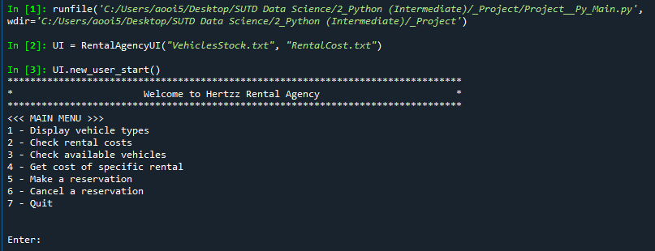
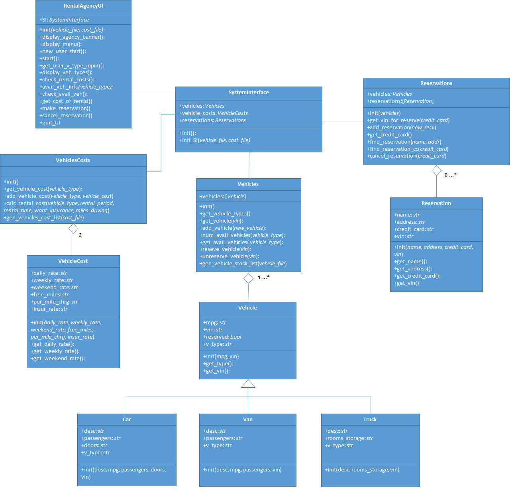

## Software Documentation - Vehicle Rent Program
#### Augustine Ooi
### Objective
Develop a program capable of maintaining reservations of a vehicle rental agency (Hertzz Vehicle Rental Agency).
The software should allow users to:
- Check for available vehicles
- Request rental charges by vehicle type
- Get the cost of renting a particular type of vehicle for a specified period of time
- Make / cancel reservations

### How to run the software
1. Run the code (Vehicle_Rental.py) which creates the various object types
2. Create an instance of the UI (a RentalAgencyUI object), and also input the texts files containing vehicle stock and rental cost information
3. Initiate the UI using the new_user_start() method
4. Navigate using the selection from the menu

### Specific program requirements
- We assume here that there are three types of vehicles: (1) Cars, (2) Vans, (3) Trucks
- The program must maintain a group of specific vehicle models for the following vehicle categories: (1) Cars, (2) Vans, (3) Trucks with the following characteristics:
     - Cars: Make/model, miles-per-gallon (mpg), number of passengers, number of doors, Vehicle Identification Number (VIN)
     - Vans: Make/mode, mpg, number of passengers, VIN
     - Trucks: Length, mpg, number of rooms, VIN
- The program must be able to display the specific vehicles available for rent by vehicle type
- The program must be able to display the cost associated with a given type of vehicle including daily, weekend and weekly rates, insurance cost, mileage charge, no. of free miles
- The program must allow the user to determine the cost of a particular vehicle, for a type of periodic rate (i.e. daily, weekly, or weekend rates) given period of time, an estimated number of miles, and the cost of optional insurance
- The program must be able to allow a particular vehicle to be reserved and cancelled

### Program design
- The program is designed using Object-Oriented-Programming (see UML in appendix for various objects and overall design).
- We define 3 classes to store granular data for each vehicle, cost of a vehicle type, and a customer reservation:
     - <u><i>Vehicle</i> Class</u>:
          - Maintains information common to all vehicles (i.e. mpg, VIN).
          - Sub-classes (<i>Car</i>, <i>Van</i>, <i>Truck</i>) builds on the inherited method to maintain specific info of these sub-types. Each of these sub-classes is responsible for maintaining the vehicle's type, VIN and reservation status.
     - <u><i>VehicleCost</i> Class</u>:
          - Maintains costs for each vehicle type (<i>Car</i>, <i>Van</i>, <i>Truck</i>).
          - No sub-classes.
          - __init__() method passes six arguments: daily/weekly/weekend rates, number of free miles, per mile charge, daily insurance rate to initialize the object with.
          - Methods to return the respective cost components (e.g. daily rates, etc).
     - <u><i>Reservation</i> Class</u>:
          -	Maintains information for each reservation made:
               - Customer name, address, credit card number, VIN of rented vehicle.
          - No sub-classes.
          - Design similar to <i>VehicleCost</i> Class.
- For each of these 3 classes above, we define a corresponding <b>aggregator class</b> to maintain a collection of the corresponding object types. Each of these aggregator classes has methods to add and retrieve a single granular object (e.g add a new <i>Car</i> object to the existing list of of Vehicles).
     - <u><i>Vehicles</i> Class</u>:
          - Aggregates <i>Vehicle</i> object. These objects are stored in a list to facilitate finding and retrieving specific vehicles. 
          - Contains methods to:
               - Add <i>Vehicle</i> objects to the list.
               - Based on a vehicle type, retrieve, as a list of <i>Vehicle</i>s, what is available for rental.
               - Reserve and unreserve a particular vehicle within the list of vehicles.
               - Generate list of stock vehicles available for rental based on a text (or CSV) file which is provided as input.
     - <u><i>VehicleCosts</i> Class</u>:
          - Aggregates <i>VehicleCost</i> object. These objects are stored as a dictionary { <i>vehicle_type: VehicleCost</i> } to facilitate retrieval. There should only be 3 entries for this dictionary (corresponding to 3 vehicle types).
          - Contains methods to:
               - Add <i>VehicleCost</i> objects to this dictionary.
               - Retrieve a cost of a specifice vehicle type (using the dictionary makes this lookup easy).
               - Calculate the estimated rental cost components based on input parameters.
               - A method to generate the dictionary of vehicle costs based on a text (or CSV) file which is provided as input.
     - <u><i>Reservations</i> Class</u>:
          - Aggregates <i>Reservation</i> object. These objects are stored in a list to facilitate finding and retrieving specific reservations. 
          - Contains methods to:
               - Add <i>Reservation</i> objects to the list.
               - Find a reservation based either on (name, address) or credit card number.
               - Cancel a reservation based on credit card number.
               - For now, the program assumes that a unique credit card number can only be used to make one reservation.
- <i>SystemInterface</i> Class to connect and interact with the various Classes defined above.
     - Contains a method to initialize the system with data the vehicle stock file (" <i>VehiclesStock.txt</i> ") and vehicle cost file (" <i>RentalCost.txt</i> ").
- <i>RentalAgencyUI</i> Class to start console interaction.
     - This object connects with the SystemInterface and contains various methods to retrieve, calculate and display info to the use as program requirement stated above.
     - The bulk of formatting and display methods are contained within this object.
     - As user input is required in this object, we have built in reasonable checks to catch user input errors (e.g. inputs outside the range of selections, typing in characters instead of numbers for calculations, etc). Generally if there are input errors, the program jumps back to main menu (and aborts any prior processes, if any).
     - The interface also allows reasonable chance to abort the process (e.g in the vehicle-reservation process, there is an option to stop the reservation and go back to main menu).
          
### UML Diagram

### Program limitations and areas of improvement
1. When the user quits the program (option "7" in the main menu), all existing records of the customer and vehicle reservations are deleted as the program terminates. It would be good to have the option for this to be saved before the program terminates
     - <b>Suggestion:</b> Alternatively, when the user quits the session, the system does not terminate the main session, but waits for another user to start a new reservation session. In this case, the customer and vehicle reservation data is retained.
2. The text file for vehicle stock data currently do not include the vehicle's reservation status. The system assumes when reading this file, that all vehicles are not reserved. For point 1 above, the system should be able to take into the reservation status upon initialization.
3. The system assumes that a credit card number can only make one reservation. It does not check this when reservations are made, but to cancel the reservation, it will delete (using the <i>pop</i> method) the first reservation with the credit card number it can find.
     - <b>Comment:</b> Multiple reservations with the same credit card can be done, if cancellations are tracked through the credit card and VIN.
4. Calculating the rental cost is still rather manual and the user needs to key in some information (e.g. daily or weekly rental).
     - <b>Suggestion:</b> Ask the user to input the dates that they'd like to rent the vehicle. System can automatically calculate the cost based on various permutation (e.g. if the dates cover the weekend, use weekend rate; if days are more than 7 days, use a combination of weekend and daily rates) and display the optimal cost to the user.
5. The cost structure is rather confusing, especially pertaining to Free Miles (is it per day, or for the entire rental period? --> This can potentially be unfair for different rental periods).
     - <b>Comment:</b> Can consider Free Miles as a function of rental periods, or the total miles driven.
